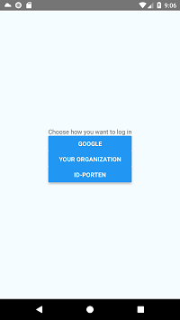
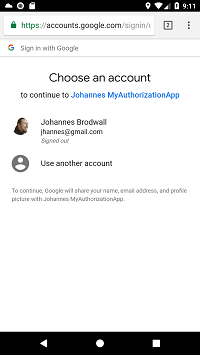
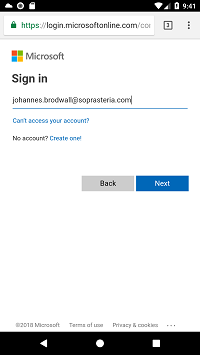
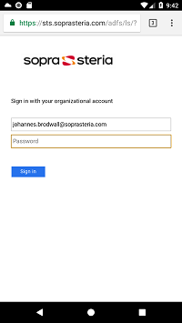
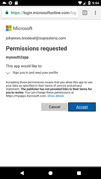

# Building React Native applications with Oauth2 for Azure AD and ID-porten

In this tutorial, I will walk you through setting up a React Native application to autenticate with some important Oauth2 providers: Google, Azure Active Directory and (for Norwegians) ID-porten.

If your application can know which user it talks with for sure, you can do anything. If you cannot trust your user, you can do nothing.

This is why Oauth2 is important. Oauth2 provides a common way for Identity Providers to link their users to third party applications. "Connect with Facebook", or Google, or Twitter, or GitHub has enabled many new applications in the consumer market. If you're new to OAuth2, I recommend you start with the excellent [OAuth 2.0 Simpified](https://aaronparecki.com/oauth-2-simplified/) guide.

But in the business and public sector, these Identity Providers will not do. Luckily, you can use other providers here.

Very many organizations use Active Directory as a hub in their Identity and Access Management. Most of these organizations have one or more cloud-based applications that authorize with their Active Directory through Azure AD and Oauth2. Through multi-tenant Azure AD applications, you can authenticate your app with any organization's Active Directory, without involving any admins in these organizations. This means that you can know for sure if a user is recognized by a particular business.

If you are developing solutions in the Norwegian public sector, you may also be interested in knowing that ID-porten, the national portal for authorization of end users now supports Oauth2 and OpenID Connect. This means for sure that you can recognize that you're talking to a Norwegian resident.

When developing native applications, including React Native, the strongly recommended approach is to open a web browser to authenticate the user. In order to attach the login session with the app, you need to use application deep links to return the authentication information to the app. This is not difficult, but it's also not well documented. Hence this article.

## Overview of the login flow

1. An unidentified user opens the app
2. The app presents the user with a number of login options
3. When the user chooses a login provider, the app opens *an external browser window* with the selected provider
4. The user performs authorization (if needed) and gives consent (if needed)
5. The browser is redirected back to an URL controlled by the app. This relaunches the app an autentication code
6. The app sends the authentication code to it's own backend, which adds a client_secret (only known by the backend) and forwards the request to the identity provider's token endpoint
7. The backend server receives access_token and optionally identity_tokens and refresh_tokens. It uses these to establish the user's identity
8. The backend server returns the login information to the app, where it can be displayed to the user


With the theory out of the way, let's get started.

### Step 1: Create a React Native application

I will be demonstrating the app on Android, but it will work more or less the same in iOS. You need ANDROID_SDK and an emulator to play along.

```bash
npm install -g react-native-cli
react-native init MyAuthorizationApp
cd MyAuthorizationApp
npm install
react-native run-android
# Some dependencies for later
npm install --save qs random-string url-parse jshashes
```

I recommend using Visual Studio Code for React Native development. Open the MyAuthorizationApp directory in Code and install the React Native extension. Select Debug > Add Configuration and add React Native. Now you can simply press F5 to start the debugger.

### Setting up the login provider (using Google as an example)

Every login provider will require some setup. For Google, this is what you need to do:

1. Create a new project in [Google APIs developer console](https://console.developers.google.com/projectcreate)
2. After you have selected a name, you need to wait a couple of minutes for the project to be created
3. Go to the [API credentials](https://console.developers.google.com/apis/credentials) screen
4. Select "Create credential" > "Oauth client" and select Application type "Web application"
5. Authorized redirect URIs are the most important. For now, let's just configure localhost.
   We need the redirect URIs to specify which login provider we're dealing with, so
   `http://localhost:8084/oauth2proxy/google/oauth2callback` is a good redirect URI
6. When you complete the registration, you will get a client id and a client secret. At first
   we will need to save the client id to a file named `env.js`:
   ```
   GOOGLE_CLIENT_ID=...
   ```
7. We will use [React Native Config](https://github.com/luggit/react-native-config) to
   handle the configuration. Run `npm install react-native-config --save-dev` to
   install it, and put the line `react-native link react-native-config` to install
   the platform modules.

### Step 2: Redirect unauthenticated users to log in

Update the `App` in `App.js`

```javascript
import React from 'react';
import {Platform, StyleSheet, Text, View, Button} from 'react-native';

export default class App extends React.Component {
  state = {};

  render() {
    const {user} = this.state;
    if (!user) {
    return (
      <View style={styles.container}>
        <LoginView />
        </View>
      );
    }
    // Keep the existing code
  }
}
```

The LoginView lets the user choose how to log in:

```javascript
const loginProviders = {
  google: {
    title: "Log in with Google"
  },
  azure: {
    title: "Log in with your organization"
  },
  idPorten: {
    title: "Log in with ID-porten"
  }
};

class LoginView extends React.Component {
  state = {}

  handleLogin = (key) => {
    const loginProvider = loginProviders[key];
    this.setState({loginProvider});
  }

  render() {
    const {loginProvider} = this.state;
    const handleLogin = this.handleLogin;

    if (loginProvider) {
      return <Text>Logging you in with {loginProvider.title}</Text>;
    }

    return (
      <View>
        <Text>Choose how you want to log in</Text>
        {Object.entries(loginProviders).map(([key,provider]) =>
          <Button title={provider.title} onPress={() => handleLogin(key)} key={key} />)}
      </View>
    );
  }
}
```

If you run this code, you will be presented with the login options, but nothing much will happen when you select one:



### Redirect to login provider

When the user selects a login provider, we need to create an authorization URL and open a browser to that URL:

```javascript
import {StyleSheet, Text, View, Button, Linking, AsyncStorage} from 'react-native';
import qs from 'qs'; // npm install --save qs
import randomString from 'random-string'; // npm install --save random-string
import Hashes from 'jshashes'; // npm install --save jshashes
// ...


const loginProviders = {
  // For configuration values, see https://accounts.google.com/.well-known/openid-configuration
  // For Administration, see https://console.developers.google.com/apis/credentials
  google: {
    title: "Google",
    redirect_uri: Config.BACKEND + '/google/oauth2callback',
    client_id: Config.GOOGLE_CLIENT_ID,
    response_type: 'code',
    scope: 'profile email',
    code_challenge_method: "S256",
  },
  // We'll get around to the others later

// ...

  handleLogin = (key) => {
    const loginProvider = loginProviders[key];
    this.setState({loginProvider});
    const {client_id, authorization_endpoint, redirect_uri, response_type, scope, code_challenge_method} = loginProvider;

    // PKCE - https://tools.ietf.org/html/rfc7636
    //  - Protect against other apps who register our application url scheme
    const code_verifier = code_challenge_method && randomString({length: 40});
    const code_challenge = code_challenge_method && sha256base64urlencode(code_verifier);

    // Protect against rogue web pages that try redirect the user to authorize (XSRF)
    const state = randomString();

    const params = {client_id, redirect_uri, response_type, scope, state, code_challenge_method, code_challenge};
    const authorizationUrl = authorization_endpoint + "?" + qs.stringify(params);

    Promise.all([
      AsyncStorage.setItem("code_verifier", code_verifier || ""),
      AsyncStorage.setItem("state", state)  
    ]).then(() => {
      console.log(authorizationUrl);
      Linking.openURL(authorizationUrl);
    }).catch(err => {
      console.warn(err)
    });
  }
```

When you run this application, the app will open an external web browser on device with the appropriate login screen.



Of course, the redirect_uri needs to bring the user back to the application. Right now it just goes to a URL where nothing lives.

### Handle the redirect

When the user logs in and consents to the application getting to know them better, the login provider redirects the user's browser to the `redirect_uri`. We want this to use an application URL scheme like `myoauth2app://` to redirect back to the app. However, Open ID providers don't let you use custom URL schemes for your redirect_uri. The solution is to redirect to a backend (during development http://localhost:8084) which redirects back to the app URL.

When you debug in the iPhone emulator, localhost URLs will automatically redirect to the host computer. In order to achieve the same in Android, just use the following ADB command:

`adb reverse tcp:8084 tcp:8084`

With that out of the way, we need to run a web server that will handle the redirect and redirect the user again, this time to an application URL. Let's create the server with Express.

```bash
mkdir MyAuthorizationServer
cd MyAuthorizationServer
npm init --yes
npm install --save express
```

A simple `server.js`-file is all that's needed:

```javascript
const express = require('express')
const app = express()

app.get('/oauth2/:loginProvider/oauth2callback', (req, res) => {
    res.redirect('myoauth2app://myapp.com' + req.url);
});

app.listen(8084, () => console.log('Example app listening on port 8084!'))
```


### Handle the redirect (Android)

In order to handle the redirect back to the application, your application must register the `myoauth2app` URI scheme with the mobile operating system. In Android, this is done by updating the `android/app/src/main/AndroidManifest.xml` file and adding a `android.intent.action.VIEW` intent-filter. Here is the final `<application>` definition:

```xml
<application
	android:name=".MainApplication"
	android:label="@string/app_name"
	android:icon="@mipmap/ic_launcher"
	android:allowBackup="false"
	android:launchMode="singleTask"
	android:theme="@style/AppTheme">
	<activity
	android:name=".MainActivity"
	android:label="@string/app_name"
	android:configChanges="keyboard|keyboardHidden|orientation|screenSize"
	android:windowSoftInputMode="adjustResize">
	<intent-filter>
		<action android:name="android.intent.action.MAIN" />
		<category android:name="android.intent.category.LAUNCHER" />
	</intent-filter>
	<intent-filter>
		<action android:name="android.intent.action.VIEW"/>
		<category android:name="android.intent.category.DEFAULT"/>
		<category android:name="android.intent.category.BROWSABLE"/>
		<data android:scheme="myoauth2app" />
	</intent-filter>
</activity>
```

*You have to restart the debugger and run `npm run android` (or F5 in VS Code) to pick up changes in the `AndroidManifest.xml`.*

(Note: We could have used `https://`-urls for Android, but iOS is more restrictive about this, so the easiest is to use the same custom scheme for both)

### Handle the redirect (iOS)

You should set up XCode to handle `myoauth2app://`-urls. See ][https://developer.apple.com/documentation/uikit/core_app/allowing_apps_and_websites_to_link_to_your_content/defining_a_custom_url_scheme_for_your_app]. In React Native, you need to do make the following changes:

1. Update the app info.plist to contain `myoauth2app` as a URL
2. Add `openURL` and `continueUserActivity` to `ios/MyAuthorizationApp/AppDelegate.m`. See [https://facebook.github.io/react-native/docs/linking]

This is what is added to `info.plist`:

```xml
<dict>
  <key>CFBundleURLTypes</key>
  <array>
    <dict>
      <key>CFBundleURLName</key>
      <string>myoauth2app</string>
      <key>CFBundleURLSchemes</key>
      <array>
        <string>myoauth2app</string>
      </array>
    </dict>
  </array>
```
This is what's added to `AppDelegate.m`:

```objectivec
#import <React/RCTLinkingManager.h>

- (BOOL)application:(UIApplication *)application
   openURL:(NSURL *)url
   options:(NSDictionary<UIApplicationOpenURLOptionsKey,id> *)options
{
  return [RCTLinkingManager application:application openURL:url options:options];
}
```

### Requesting access token

When the application is reopened, we can get the appropriate information by calling `Linking.getCurrentURL` (for Android) or `Linking.addEventListener` (for iOS).

```javascript
import URL from 'url-parse'; // npm install --save url-parse
// ...

const loginProviders = {
  google: {
    // ...
    token_endpoint: BACKEND + "/oauth2/google/token",
    grant_type: "access_code"
  },
};

class App extends React.Component {

  handleOpenUrl = (url) => {
    this.handleRedirectUri(url);
  }
  
  componentDidMount() {
    Linking.addEventListener("url", this.handleOpenUrl);
    Linking.getInitialURL().then(url => {
      if (url) this.handleRedirectUri(url);
    });
  }

  componentWillUnmount() {
    Linking.removeEventListener("url", this.handleOpenUrl);
  }

  handleRedirectUri(urlString) {
    const url = new URL(urlString, true);
    const {code, state} = url.query;

    console.log("App url: " + url);

    if (!code) return;

    const providerName = url.pathname.split("/")[2];
    const loginProvider = loginProviders[providerName];

    const {token_endpoint, grant_type, client_id, redirect_uri} = loginProvider;

    Promise.all([
      AsyncStorage.getItem("state"),
      AsyncStorage.getItem("code_verifier")
    ]).then(([request_state, request_code_verifier]) => {
      AsyncStorage.removeItem('state');
      AsyncStorage.removeItem('code_verifier');
      if (state != request_state) {
        console.log("State mismatch, don't carry out the token request", state, request_state);
        return;
      }

      const code_verifier = request_code_verifier || undefined;

      const payload = {code, code_verifier, client_id, redirect_uri, grant_type};
      console.log(qs.stringify(payload));
      return fetch(token_endpoint, {
        method: 'POST',
        headers: {
          'Content-type': 'application/x-www-form-urlencoded'
        },
        body: qs.stringify(payload)
      }).then(resp => resp.json())
      .then(user => this.setState({user}))
      .catch(err => {
        console.warn("something went wrong", err);
      });
    });
  }
}
```

Importantly, the `token_end` *should not* be the real token URI for the login provider. Instead, it should be your own backend. This way we can protect the `client_secret` of our application. I expand the `server.js` file in the express project to handle token posts:

```javascript
const bodyParser = require('body-parser'); // npm install --save body-parse
const fetch = require('node-fetch'); // npm install --save node-fetch

const loginProviders = {
    // For configuration values, see https://accounts.google.com/.well-known/openid-configuration
    // For Administration, see https://console.developers.google.com/apis/credentials
    google: {
        client_secret: '...', // Get yours at https://accounts.google.com/.well-known/openid-configuration
        token_endpoint: 'https://accounts.google.com/o/oauth2/token',
    }
};

// ..

function base64decode(encoded) {
    return new Buffer(encoded, 'base64').toString('ascii');
}

app.post('/oauth2proxy/:loginProvider/token', (req, res) => {
    const {client_id, code, code_verifier, redirect_uri, grant_type} = req.body;
    const {loginProvider} = req.params;

    const configuration = loginProviders[loginProvider];
    const {token_endpoint, client_secret} = configuration;

    const payload = qs.stringify({client_id, client_secret, code, redirect_uri, code_verifier, grant_type});
    console.log(payload);

    fetch(token_endpoint, {
        method: 'POST',
        headers: {
            'Content-type': 'application/x-www-form-urlencoded'
        },
        body: payload
    }).then(response => {
        console.log(response.status);
        return response.json();
    }).then(tokenResponse => {
        console.log(tokenResponse);
        const id_token = JSON.parse(base64decode(tokenResponse.id_token.split('.')[1]));
        console.log(id_token);
        res.send({
            username: id_token.name
        });
    }).catch(err => console.error);
});
```

### Display the user information

Now all that's left is to display the user information

```javascript
class App extends React.Component {
  state = {};

  render() {
    const {user} = this.state;
    if (!user) {
      return (
        <View style={styles.container}>
          <LoginView />
        </View>
      );        
    }

    return (
      <View style={styles.container}>
        <Text style={styles.welcome}>Welcome {user.username}!</Text>
      </View>
    );
  }
}
```

Voila!


### Loose ends

Currently, the App only get the user name from the backend and does not maintain it's authentication with the backend for later API calls. For a real scenario, you would either return the `id_token` or `access_token` to the client for use in later API calls, or the backend would generate it's own internal session with an access token that is sent to the client.

## Implementing more login providers

### Azure Active Directory

Azure Active Directory gives a unique possibility for developing business-to-business applications. In general, when you receive an email address and user profile information from Azure Active Directory, you can be sure that this email address has been verified according to the standards of the organization in question. In particular, if a user logs in as `someone@soprasteria.com` through Azure Active Directory, you know that my employer has verified the identity of that person.

It's very important to note: You don't need to have admin access to an existing Active Directory in order to create applications where users from *any* Active Directory can authorize themselves. This can literally be done with a Azure trial account. This is done through what's called Azure Active Directory Multi Tenant authorization.

In order to register a Azure Active Directory application:

1. Create a [new Azure Active Directory](https://portal.azure.com/#create/Microsoft.AzureActiveDirectory) if you don't already have a directory where you are admin. Here, you can control applications (and users for the directory, but you don't need that)
2. When you have created a new Azure Active Directory, you can switch between your directory with the top right-hand menu in the Azure portal
3. Create a new [Application Registration](https://portal.azure.com/#blade/Microsoft_AAD_IAM/ActiveDirectoryMenuBlade/RegisteredApps) of type "Web app/API"
4. Under Settings > Properties, make sure you switch Multi-tenanted to "yes"
5. Under Settings > Reply URLs for your application, add your redirect_uri: `http://localhost:8084/oauth2proxy/azure/oauth2callback`
6. Under Settings > Keys create a new key and save it in the configuration for your server (this should not be checked into git!)

Now, you can add the following configuration in the client:

```javascript
const loginProviders = {
  google: {
    // ...
  },
  // For configuration values, see https://login.microsoftonline.com/common/v2.0/.well-known/openid-configuration
  // For Administration, see https://portal.azure.com/#blade/Microsoft_AAD_IAM/ActiveDirectoryMenuBlade/RegisteredApps
  azure: {
    title: "Log in with your organization",
    redirect_uri: BACKEND + '/oauth2/azure/oauth2callback',
    client_id: Config.AZURE_CLIENT_ID, // The Application ID of your Application Registration
    response_type: 'code',
    scope: 'openid profile User.Read',
    authorization_endpoint: "https://login.microsoftonline.com/common/oauth2/authorize",
    token_endpoint: BACKEND + "/oauth2/azure/token",
    grant_type: "authorization_code"
  },
```

When the user logs in with "Your organization", they will be presented first with a generic Azure Active Directory login:



When you enter your organization email address, you are presented with a branded login screen:



The password here is generally the same as the user uses to log onto their work computer. The first time a user logs into a Multi-tenant application, they are prompted with a onsent screen:



For the server, add the configuration:

```javascript
const loginProviders = {
    google: {
      // ...
    },
    // For configuration values, see https://login.microsoftonline.com/common/v2.0/.well-known/openid-configuration
    // For Administration, see https://portal.azure.com/#blade/Microsoft_AAD_IAM/ActiveDirectoryMenuBlade/RegisteredApps
    azure: {
        client_secret: Config.AZURE_CLIENT_SECRET,
        token_endpoint: 'https://login.microsoftonline.com/common/oauth2/token'
    }
};
```

The claims of the `id_token` returned will be somewhat different from what we got back from Google, so reading the id_token must be updated as well:

```javascript
        const id_token = JSON.parse(base64decode(tokenResponse.id_token.split('.')[1]));
        res.send({
            username: id_token.name || id_token.email
        });
```

The most important properties are `name`, `upn` (which contains the email address) and `tid` or Tenant ID, which is the unique identifier of the organization that authorized this user. If you create an application that can be used by multiple organizations, this is where you find the organization identifier.


## Conclusions

1. Oauth2 is great for many authentication scenarios, whether commercial, internal in an organization or in public sector
2. Standardization makes it easy to integrate many login providers
3. Mobile apps should use an external browser to authenticate the user and return to the app via a registered URL, as per [RFC 8252](https://tools.ietf.org/html/rfc8252)
4. Mobile apps should use code_challenge and code_verifier [PKCE](https://tools.ietf.org/html/rfc7636) to defeat malicious apps on the same OS
5. In Android, use `VIEW` intent to register a browser URL; in iOS, add `CFBundleURLTypes` to `info.plist`.
6. Mobile apps need a backend to protect the `client_secret` for the token request
7. Login providers like Azure Active Directory and ID-porten (Norway) can provide your app with high confidence of the actual identity of the user.

See the [complete code](https://github.com/jhannes/react-native-oauth-demo) on my github account.
